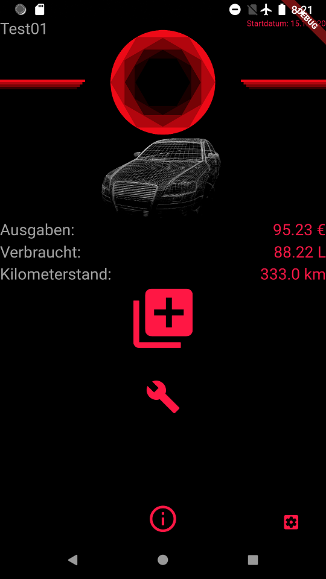

# lilith

The app was developed out of boredom and some laziness. I just wanted to keep track of some basic statistics of my car.
Since I hate all the hyper-connected apps that need a sh*tload of permissions, I designed this one to be pure "offline".

It is powered by HiveDB, which is a charm to work with.

## Important information

 - I am not a developer at all
 - None of the code is "perfect" and far from done
 - I am open to any improvement, but I have very limited time
 - This repo is actually just for me but if someone wants to run the app: you are welcome to do so :)
 - I just created some dummy backgrounds because I do not own any rights to car brand logos and vehicle designs, just replace the round shape with your logo of choice and the wireframe with an actual model

## Basic usage

If you start the app everything is organized in buttons that are "language agnostic".

- the purpose of this app is to keep track of money, gas and distance so the biggest button is to set this entry every time you fill up
- the lower middle button with the "information icon" is to see basic statistics about your entries
- on the lower right you can change colors or go to settings
- the settings provide a license plate text field (since I wanted that displayed on my main screen) and a possibility to change your entered data (in case you messed up or else)

## Feature TODOs

- backup of HiveDB
- add charts for monthly statistics
- add maintenance widgets (shout out to: Riccardo :D)
- optional: add some more languages that can be set in the settings menu

## Preview (amber)

- Main screen; color amber

 - Edit screen (add entry); color amber

- Settings screen; color amber

